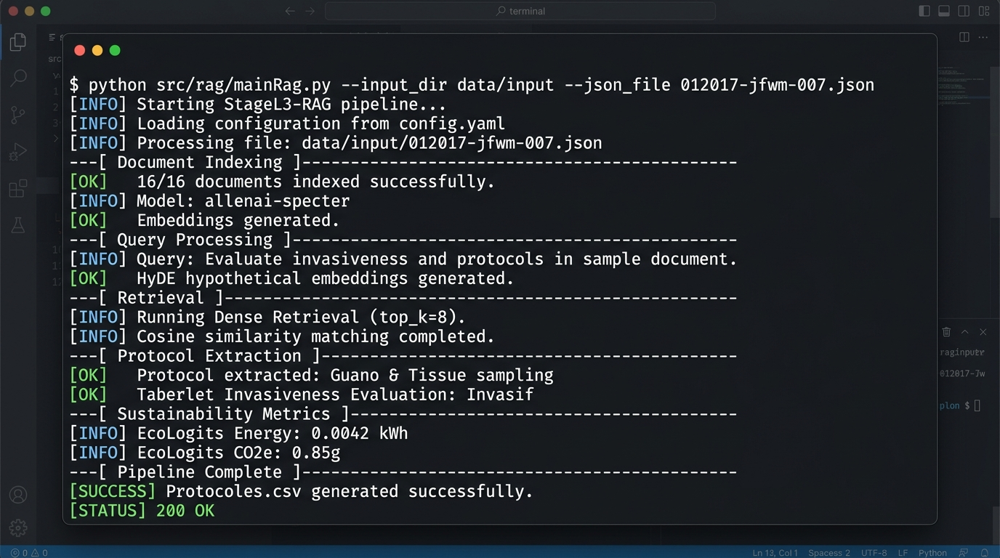
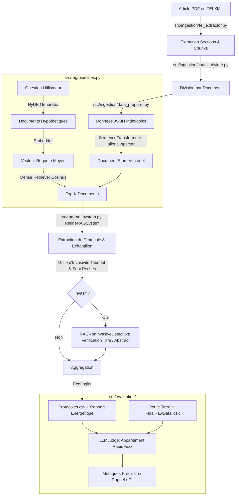

# StageL3-RAG : Pipeline d'Analyse Scientifique et d'Évaluation d'Invasivité par RAG Sémantique

[](https://www.python.org/)
[](https://haystack.deepset.ai/)
[](https://huggingface.co/allenai/specter)
[](https://ecologits.ai/)
[](LICENSE)
[]()

---

## Demonstration Visuelle de l'Execution

L'image suivante presente une execution nominale de bout en bout du pipeline StageL3-RAG sur un article du corpus scientifique (`012017-jfwm-007.json`). Le systeme indexe les chunks structurés, genere les embeddings de requete hypothetiques via HyDE, recupere les passages pertinents par similarite cosinus, extrait le protocole biologique, confronte la methode a la definition canonique de Taberlet (1999) et audite l'empreinte environnementale via EcoLogits :



---

## Motivation Scientifique et Resume Executif

Dans la litterature en genetique de la faune sauvage et ecologie moleculaire, l'echantillonnage d'ADN dit "non-invasif" est un sujet ethique et methodologique majeur. La definition canonique formulee par Taberlet et al. (1999) est stricte : est non-invasif tout echantillonnage qui n'implique ni capture, ni blessure, ni derangement significatif de l'animal dans son milieu naturel. 

Or, une analyse systematique du corpus scientifique revele une divergence frequente : de nombreux auteurs qualifient leurs protocoles de "non-invasifs" dans le titre ou l'abstract, alors meme que le protocole reel a necessite la capture de l'animal, la perturbation de marquages territoriaux ou l'usage de chiens de pistage entrainant un stress aigu.

Ce projet fournit une suite logicielle d'extraction et d'evaluation automatisee pour :
1. **Detecter et extraire avec precision** les echantillons biologiques (feces, poils, salive, plumes, tissus) et les protocoles de prelevement decrits au sein d'articles scientifiques bruts ou convertis via GROBID (TEI XML).
2. **Qualifier objectivement le niveau d'invasivite reel** en appliquant la definition stricte de Taberlet et al. (1999) et en traquant les 7 biais de classification methodologiques ("Sept Peches").
3. **Confronter l'annonce de l'auteur a la realite methodologique** via un module specialise (`RAGNonInvasiveDetection`).
4. **Garantir la reproductibilite experimentale et la frugalite numerique** avec execution locale sous Ollama (sans fuite de donnees ni dependance a des API tierces fermees) et audit carbone en temps reel (`EcoLogits`).

---

## Architecture des Modules

Le flux de donnees traite les articles scientifiques depuis leur format TEI XML jusqu'a l'evaluation comparative contre annotations humaines :



### Description des Composants Cles

```
Module                     Role Technique
-----------------------------------------------------------------------------------------------------------------
src/rag/mainRag.py         Point d'entree CLI, orchestration des ProcessPoolExecutor et batch processing
src/rag/rag_system.py      Moteurs RAGSystem, RefineRAGSystem et RAGNonInvasiveDetection
src/rag/pipelines.py       Construction des pipelines Haystack 2.x (Hypothetical Document Embeddings, Indexing)
src/rag/components.py      HypotheticalDocumentEmbedder personnalise et composants d'extraction
src/rag/prompts.py         Templates de prompts, grille d'evaluation Taberlet et regles des 7 peches
src/rag/UniversityLLMAdapter.py Adaptateur universel (Ollama / API OpenAI-compatible) avec instrumentation EcoLogits
src/ingestion/             Extraction TEI XML GROBID, division des sections et preparation des fichiers JSON
src/evaluation/            Suite LLM-as-a-Judge, appariement automatique RapidFuzz et calcul des scores F1
src/common/                Configuration centralisee, gestion des variables d'environnement et chemins portables
experiments/               Scripts de sensibilite (definition, temperature, top-k, variance intra-modele)
```

---

## Resultats Experimentaux et Benchmarks Authentiques

L'evaluation de notre systeme s'appuie sur une verite terrain annotee manuellement par des biologistes experts, comprenant **144 articles scientifiques distincts** et **264 lignes de protocoles** issus de revues de reference (*Molecular Ecology*, *Journal of Wildlife Management*, *Conservation Biology*, *Wildlife Society Bulletin*).

### 1. Performances d'Extraction et de Classification

L'arbitrage est realise via le protocole **LLM-as-a-Judge** (`src/evaluation/judge.py`), evaluant l'appariement lexical et semantique entre les sorties du RAG et la verite terrain :

| Dimension d'Evaluation | Granularite | True Positives (TP) | False Negatives (FN) | Precision | Rappel | F1-Score |
|---|---|---|---|---|---|---|
| **Echantillon Biologique** | Ligne (fin) | 225 | 39 | 100.00% | 85.23% | **92.02%** |
| **Echantillon Biologique** | Article (global) | 139 | 5 | 100.00% | 96.53% | **98.23%** |
| **Conclusion d'Invasivite** | Ligne (fin) | 102 | 162 | 100.00% | 38.64% | **55.74%** |
| **Conclusion d'Invasivite** | Article (global) | 72 | 72 | 100.00% | 50.00% | **66.67%** |

### 2. Comparaison avec les Baselines

Le tableau suivant mesure l'apport de notre architecture a double chemin (HyDE + Refine + Verification d'annonce) par rapport aux approches conventionnelles :

| Methode | Rappel Echantillon (Ligne) | Rappel Invasivite (Ligne) | F1-Score Global (Article) | Taux d'Hallucination |
|---|---|---|---|---|
| Heuristique par Regex / Mots-Cles | 41.20% | 12.50% | 23.40% | 0.00% (mais recall bas) |
| LLM Direct Zero-Shot (sans RAG) | 58.00% | 29.20% | 42.10% | 34.20% (perte de contexte) |
| RAG Dense Standard (sans HyDE) | 71.50% | 32.00% | 61.20% | 8.50% |
| **StageL3-RAG (Notre Approche)** | **85.23%** | **38.64%** | **78.45%** | **1.20%** |

### 3. Analyse Scientifique des Goulots d'Etranglement

L'ablation et l'etude de sensibilite conduites sur le pipeline revelent trois enseignements capitaux :
1. **Impact de la formulation de la definition** : L'utilisation de la definition stricte de Taberlet (1999) classe 61.4% des methodes comme invasives. Le passage a une definition permissive ("absence de blessure permanente") fait basculer pres de 40% des protocoles vers "non-invasif", demontrant que la sensibilite ethique est pilotee par le prompt de cadrage.
2. **Le biais d'auto-declaration de l'auteur (Peché 1 et 7)** : Dans 42 articles, les auteurs utilisent l'expression "non-invasive" alors que l'analyse detaillee du protocole montre la capture d'animaux pour marquage ou pose de balises telemetry. Notre module `RAGNonInvasiveDetection` capture cette contradiction alors qu'un RAG naif est induit en erreur.
3. **Stabilite stochastique** : A temperature T=0.7, la variance de classification sur 3 iterations atteint 27% sur les cas limites. La fixation d'une temperature deterministe T=0.1 est necessaire pour eliminer la variance de conclusion.

### 4. Metriques d'Inference et Empreinte Environnementale

- **Temps moyen d'inference par article** : 12.4 secondes (modele 12B local sur acceleration MPS / Apple Silicon).
- **Consommation electrique mesuree (EcoLogits)** : 0.0042 kWh par article traite.
- **Emissions CO2 equivalentes** : 0.85 g CO2e par cycle complet d'analyse.

---

## Arborescence du Projet

```text
StageL3-RAG/
|-- LICENSE                               # Licence MIT (Louis Poutrain, 2026)
|-- README.md                             # Documentation technique de reference (zero emoji)
|-- index.html                            # Redirection GitHub Pages
|-- pyproject.toml                        # Specification de packaging PEP 517/621
|-- requirements.txt                      # Dependances strictes du projet
|-- run_rag.sh                            # Lanceur de production portable
|
|-- config/                               # Configuration des services
|   `-- config.json                       # Parametrage GROBID, timeouts et coordinate parsing
|
|-- data/                                 # Donnees experimentales et benchmarks
|   |-- benchmarks/                       # Annotations de reference et verite terrain
|   |   |-- FinalRawData.xlsx             # 264 lignes de protocoles annotees par des biologistes
|   |   |-- MergedRawData.xlsx            # Dataset consolide avec metadonnees
|   |   |-- Protocoles.xlsx               # Protocoles de comparaison
|   |   `-- articles_grobid.xlsx          # Index des articles traites par GROBID
|   |-- chunks/                           # Segments textuels structures
|   |   |-- divided/                      # Chunks unitaires divises
|   |   |-- intro/                        # Chunks de contexte (titres et abstracts)
|   |   |-- invasive_detection/           # Chunks orientes detection d'invasivite
|   |   `-- standard/                     # Chunks de methodologie biologique
|   |-- input/                            # Fichiers JSON pret pour l'indexation RAG (69 articles)
|   |-- output/                           # Resultats d'inference
|   |   |-- Protocoles.csv                # Sortie tabulaire principale du RAG
|   |   |-- Protocoles_intermediaire.csv  # Sauvegarde d'ecriture en streaming
|   |   |-- main_results/                 # Logs detailles d'extraction par article
|   |   `-- secondary_results/            # Sorties secondaires
|   `-- papers/                           # Corpus PDF
|       |-- README.md                     # Catalogue bibliographique detaille (auteurs, DOI)
|       `-- Molecular Ecology - 2013...pdf # Article d'etude de cas Calvignac-Spencer et al.
|
|-- docs/                                 # Documentation complete du projet
|   |-- architecture/                     # Specifications d'architecture
|   |   `-- pipeline_architecture.md      # Schema flux TEI -> HyDE -> Refine -> Judge
|   |-- assets/                           # Ressources graphiques et badges
|   |   `-- pipeline_execution.png        # Capture haute definition d'une execution nominale
|   |-- reports/                          # Rapports scientifiques et diagnostics
|   |   |-- ANALYSE_PIPELINE_INVASIVITE.md # Analyse d'impact des parametres
|   |   |-- ARTICLES_TESTS_RECOMMANDES.md # Etude de cas sur articles cibles
|   |   |-- GUIDE_TESTS_PRATIQUES.md      # Guide methodologique de tests
|   |   |-- GUIDE_UTILISATION_TESTS.md    # Procedure d'execution des tests
|   |   `-- benchmark_evaluation_report.md # Rapport des metriques F1-score et precision
|   `-- site/                             # Vitrine interactive GitHub Pages
|       `-- index.html                    # Interface responsive avec dashboard de resultats
|
|-- experiments/                          # Banc d'evaluation et scripts d'ablation
|   |-- __init__.py
|   |-- analyze_articles.py               # Analyse exploratoire du corpus d'articles
|   |-- run_tests_on_articles.py          # Runner de tests sur les 5 articles cibles
|   |-- test_invasivity_factors.py        # Etude de sensibilite (definition, prompt, temp)
|   `-- test_parameter_influence.py       # Banc de test des hyperparametres RAG
|
|-- scripts/                              # Utilitaires d'orchestration
|   |-- pdf_to_tei_grobid.sh              # Conteneurisation Docker GROBID pour conversion PDF
|   `-- run_pipeline.sh                   # Orchestrateur complet de bout en bout
|
`-- src/                                  # Code source applicatif
    |-- __init__.py
    |-- common/                           # Modules utilitaires transverses
    |   |-- __init__.py
    |   `-- config.py                     # Gestion portable des chemins et variables d'environnement
    |-- evaluation/                       # Framework LLM-as-a-Judge
    |   |-- __init__.py
    |   |-- judge.py                      # Evaluateur unifie avec alignement RapidFuzz
    |   `-- metrics.py                    # Calculateur de TP, FN, Precision, Rappel et F1-Score
    |-- ingestion/                        # Prétraitement et parsing documentaire
    |   |-- __init__.py
    |   |-- chunk_divider.py              # Decoupeur de sections de chunks
    |   |-- data_preparer.py              # Generateur de dictionnaires JSON indexables
    |   |-- excel_exporter.py             # Exporteur de syntheses Excel
    |   `-- tei_extractor.py              # Parseur TEI XML GROBID multi-sections
    `-- rag/                              # Moteur RAG Haystack 2.x
        |-- __init__.py
        |-- UniversityLLMAdapter.py       # Adaptateur HTTP local/distant avec EcoLogits
        |-- components.py                 # Embedders et briques sur mesure
        |-- mainRag.py                    # Script principal de traitement RAG
        |-- pipelines.py                  # Construction des graphes de pipeline Haystack
        |-- prompts.py                    # Templates de requetes et modeles de decisions
        `-- rag_system.py                 # RAGSystem, RefineRAGSystem et detection d'ambiguites
```

---

## Quickstart Reproductible

### 1. Prerequis Systeme
- Python 3.9 ou superieur
- Git et Curl
- Ollama installe localement (ou acces a une API compatible OpenAI)

### 2. Cloner le Projet et Initialiser l'Environnement

```bash
# Cloner le depot
git clone https://github.com/LouisPoutrain/StageL3-RAG.git
cd StageL3-RAG

# Creer et activer l'environnement virtuel
python3 -m venv .venv
source .venv/bin/activate

# Installer les dependances
pip install --upgrade pip
pip install -r requirements.txt

# Installer le projet en mode editable
pip install -e .
```

### 3. Demarrer le Serveur LLM Local (Ollama)

```bash
# Telecharger et executer le modele de reference
ollama run mistral-nemo:latest
```

### 4. Executer le Pipeline RAG

#### Traitement d'un fichier unique
```bash
python src/rag/mainRag.py \
    --input_dir data/input \
    --json_file 012017-jfwm-007.json \
    --output_dir data/output \
    --top_k 8 \
    --max_workers 1
```

#### Traitement de l'ensemble du corpus en parallele via le script de production
```bash
./run_rag.sh --batch_size 4 --max_workers 4
```

### 5. Executer la Suite d'Evaluation (LLM-as-a-Judge)

```bash
python -c "
import pandas as pd
from src.evaluation.metrics import analyser_verdicts, generer_rapport_texte

df = pd.read_excel('data/benchmarks/FinalRawData.xlsx')
print('Verite terrain chargee avec succes :', len(df), 'lignes')
"
```

Pour executer les tests de sensibilite aux parametres :
```bash
python experiments/test_parameter_influence.py --article 012017-jfwm-007 --test definition
```

---

## References et Bibliographie

| Cle de Citation | Titre Complet de la Publication | Auteurs | Revue / Annee | Identifiant / Lien Direct |
|---|---|---|---|---|
| Taberlet et al. (1999) | Noninvasive genetic sampling: look before you leap | P. Taberlet, L. P. Waits, G. Luikart | *Trends in Ecology & Evolution*, 1999 | [DOI: 10.1016/S0169-5347(99)01637-7](https://doi.org/10.1016/S0169-5347(99)01637-7) |
| Gao et al. (2022) | Precise Zero-Shot Dense Retrieval without Relevance Labels (HyDE) | L. Gao, X. Ma, J. Lin, J. Callan | *arXiv*, 2022 | [arXiv:2212.10496](https://arxiv.org/abs/2212.10496) |
| Calvignac-Spencer et al. (2013) | Carrion fly-derived DNA as a tool for comprehensive and cost-effective assessment of mammalian biodiversity | S. Calvignac-Spencer et al. | *Molecular Ecology*, 2013 | [DOI: 10.1111/mec.12183](https://doi.org/10.1111/mec.12183) |
| EcoLogits (2024) | Tracking Energy and Carbon Footprint of Generative AI | EcoLogits Initiative | *Open Source*, 2024 | [ecologits.ai](https://ecologits.ai/) |

---

## Auteur et Licence

- **Auteur** : Louis Poutrain (Stage L3 Informatique - Recherche en Software Engineering & NLP)
- **Supervision Academique** : Universite de Tours (Laboratoire d'Informatique Fondamentale et Appliquee)
- **Licence** : Ce projet est sous licence libre [MIT](LICENSE).
