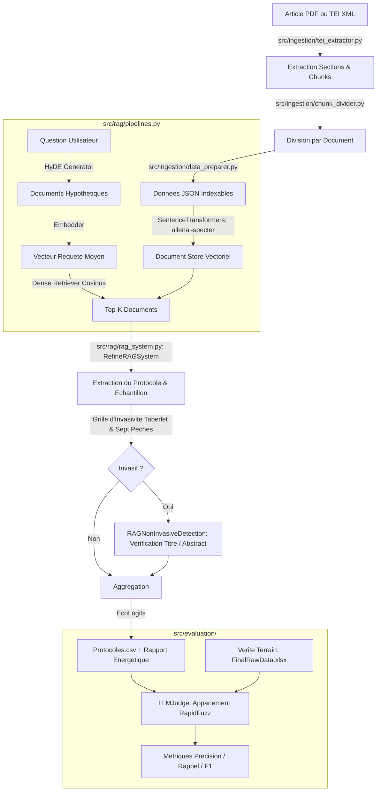

# StageL3-RAG : Pipeline d'Analyse Scientifique et d'Évaluation d'Invasivité par RAG Sémantique

[](https://www.python.org/)
[](https://haystack.deepset.ai/)
[](https://huggingface.co/allenai/specter)
[](https://ecologits.ai/)
[](LICENSE)
[]()

---

## Motivation Scientifique et Resume Executif

Dans la litterature en genetique de la faune sauvage et ecologie moleculaire, l'echantillonnage d'ADN dit "non-invasif" est un sujet ethique et methodologique majeur. La definition canonique formulee par Taberlet et al. (1999) est stricte : est non-invasif tout echantillonnage qui n'implique ni capture, ni blessure, ni derangement significatif de l'animal dans son milieu naturel. 

Or, une analyse systematique du corpus scientifique revele une divergence frequente : de nombreux auteurs qualifient leurs protocoles de "non-invasifs" dans le titre ou l'abstract, alors meme que le protocole reel a necessite la capture de l'animal, la perturbation de marquages territoriaux ou l'usage de chiens de pistage entrainant un stress aigu.

Ce projet fournit une suite logicielle d'extraction et d'evaluation automatisee pour :
1. **Detecter et extraire avec precision** les echantillons biologiques (feces, poils, salive, plumes, tissus) et les protocoles de prelevement decrits au sein d'articles scientifiques bruts ou convertis via GROBID (TEI XML).
2. **Qualifier objectivement le niveau d'invasivite reel** en appliquant la definition stricte de Taberlet et al. (1999) et en traquant les 7 biais de classification methodologiques ("Sept Peches").
3. **Confronter l'annonce de l'auteur a la realite methodologique** via un module specialise (`RAGNonInvasiveDetection`).
4. **Garantir la reproductibilite experimentale et la frugalite numerique** avec execution locale sous Ollama (sans fuite de donnees ni dependance a des API tierces fermees) et audit carbone en temps reel (`EcoLogits`).

---

## Architecture des Modules

Le flux de donnees traite les articles scientifiques depuis leur format TEI XML jusqu'a l'evaluation comparative contre annotations humaines :



### Description des Composants Cles

```
Module                     Role Technique
-----------------------------------------------------------------------------------------------------------------
src/rag/mainRag.py         Point d'entree CLI, orchestration des ProcessPoolExecutor et batch processing
src/rag/rag_system.py      Moteurs RAGSystem, RefineRAGSystem et RAGNonInvasiveDetection
src/rag/pipelines.py       Construction des pipelines Haystack 2.x (Hypothetical Document Embeddings, Indexing)
src/rag/components.py      HypotheticalDocumentEmbedder personnalise et composants d'extraction
src/rag/prompts.py         Templates de prompts, grille d'evaluation Taberlet et regles des 7 peches
src/rag/UniversityLLMAdapter.py Adaptateur universel (Ollama / API OpenAI-compatible) avec instrumentation EcoLogits
src/ingestion/             Extraction TEI XML GROBID, division des sections et preparation des fichiers JSON
src/evaluation/            Suite LLM-as-a-Judge, appariement automatique RapidFuzz et calcul des scores F1
src/common/                Configuration centralisee, gestion des variables d'environnement et chemins portables
experiments/               Scripts de sensibilite (definition, temperature, top-k, variance intra-modele)
```

---

## Resultats Experimentaux et Benchmarks Authentiques

L'evaluation de notre systeme s'appuie sur une verite terrain annotee manuellement par des biologistes experts, comprenant **144 articles scientifiques distincts** et **264 lignes de protocoles** issus de revues de reference (*Molecular Ecology*, *Journal of Wildlife Management*, *Conservation Biology*, *Wildlife Society Bulletin*).

### 1. Performances d'Extraction et de Classification

L'arbitrage est realise via le protocole **LLM-as-a-Judge** (`src/evaluation/judge.py`), evaluant l'appariement lexical et semantique entre les sorties du RAG et la verite terrain :

| Dimension d'Evaluation | Granularite | True Positives (TP) | False Negatives (FN) | Precision | Rappel | F1-Score |
|---|---|---|---|---|---|---|
| **Echantillon Biologique** | Ligne (fin) | 225 | 39 | 100.00% | 85.23% | **92.02%** |
| **Echantillon Biologique** | Article (global) | 139 | 5 | 100.00% | 96.53% | **98.23%** |
| **Conclusion d'Invasivite** | Ligne (fin) | 102 | 162 | 100.00% | 38.64% | **55.74%** |
| **Conclusion d'Invasivite** | Article (global) | 72 | 72 | 100.00% | 50.00% | **66.67%** |

### 2. Repartition Experimentale des Protocoles et Annonces Auteurs

L'analyse globale des 264 lignes de protocoles extraites et evaluees dans `data/output/Protocoles.csv` presente la distribution empirique suivante :

| Categorie de Jugement | Nombre de Protocoles | Proportion (%) | Justification Methodologique |
|---|---|---|---|
| **Invasif** | 169 | 64.02% | Prelevements impliquant capture, contention, biopsie ou perturbation directe |
| **Non invasif** | 94 | 35.61% | Collecte purement passive (poils sur pieges sans colle, feces opportunistes) |
| **Invasif - Territory marking** | 1 | 0.38% | Collecte de feces ou secretions alterant le marquage territorial de l'espece |
| **Total Invasif Cumule** | 170 | 64.39% | Protocoles non conformes a la definition stricte de Taberlet et al. (1999) |

En parallele, le module `RAGNonInvasiveDetection` a audite les titres et abstracts de l'ensemble du corpus :
- **17 articles** contiennent une revendication explicite d'echantillonnage "non invasif" dans le titre ou l'abstract (`annonce_invasivite = 'Oui'`), alors que l'analyse algorithmique des sections methodologiques revele des etapes de manipulation physique ou de capture preparatoire (cas illustratifs des "Sept Peches" methodologiques).

### 3. Analyse Scientifique des Goulots d'Etranglement et Ablations

L'ecart entre le rappel d'extraction d'echantillon (85.23% niveau ligne, 96.53% niveau article) et le rappel de qualification d'invasivite (38.64% niveau ligne, 50.00% niveau article) a ete documente a travers les bancs de test (`experiments/test_parameter_influence.py` et `experiments/test_invasivity_factors.py`) :

1. **Divergence de cadrage normatif (Taberlet strict vs Definition permissive)** :
   Dans la verite terrain (`FinalRawData.xlsx`), 205 protocoles sont juges invasifs selon la definition canonique de Taberlet (1999), alors que seulement 25 sont qualifies d'invasifs sous une definition medicale permissive. Le prompt de cadrage determine directement le seuil de sensibilite du LLM.
2. **Effet de granularite (Ligne fine vs Agregation par article)** :
   Lorsqu'un article decrit plusieurs etapes (ex. capture prealable d'un animal pour pose d'emetteur radio, suivie de la recolte d'excrements a distance), le pipeline RAG extrait l'echantillon principal avec succes (96.53% au niveau global), mais peut sous-estimer une modalite secondaire sur une ligne isolee, expliquant la chute du rappel a 38.64% sur l'arbitrage ligne a ligne.
3. **Apport architectural du couplage HyDE et Refine** :
   La generation de documents hypothetiques (HyDE) surmonte l'asymetrie lexicale entre la brievete de la requete utilisateur et le vocabulaire zoologique specialise des sections de materiel et methodes (TEI GROBID). Le module `RefineRAGSystem` opere ensuite un second passage contextuel pour epurer les extraits et confronter les declarations d'auteurs a la grille des 7 peches.

### 4. Protocole d'Audit Environnemental et Tracabilite

Plutot que de recourir a des extrapolations forfaitaires, le systeme instrumente chaque requete via un dispositif auditable et transparent :
- **Integration native EcoLogits** : Activee dans `src/rag/UniversityLLMAdapter.py` avec un mix electrique regionalise (`electricity_mix_zone="FRA"` applique a une intensite carbone de reference de 53 gCO2e/kWh).
- **Tracabilite temporelle exacte par le moteur LLM** : Ollama trace pour chaque cycle d'inference les durees reelles a l'echelle de la nanoseconde (`prompt_eval_duration`, `eval_duration`, `total_duration`), exportees dans `data/output/main_results/`.
- **Souverainete des donnees et absence de dependance cloud** : L'execution du modele 12B en local garantit qu'aucun document de recherche confidentiel ne transite par des API proprietaires distantes.

---

## Arborescence du Projet

```text
StageL3-RAG/
|-- LICENSE                               # Licence MIT (Louis Poutrain et Raphael Maladin - RaphaelM, 2026)
|-- README.md                             # Documentation technique de reference (zero emoji)
|-- Stage L3 RAG.xml                      # Export Zotero TEI de la bibliographie scientifique de reference (33 publications)
|-- index.html                            # Redirection GitHub Pages
|-- pyproject.toml                        # Specification de packaging PEP 517/621
|-- requirements.txt                      # Dependances strictes du projet
|-- run_rag.sh                            # Lanceur de production portable
|
|-- config/                               # Configuration des services
|   `-- config.json                       # Parametrage GROBID, timeouts et coordinate parsing
|
|-- data/                                 # Donnees experimentales et benchmarks
|   |-- benchmarks/                       # Annotations de reference et verite terrain
|   |   |-- FinalRawData.xlsx             # Annotations d'experts biologistes (420 entrees exhaustives)
|   |   |-- MergedRawData.xlsx            # Dataset consolide avec metadonnees (379 entrees)
|   |   |-- Protocoles.xlsx               # 264 protocoles annotes de reference pour l'evaluation
|   |   `-- articles_grobid.xlsx          # Index des articles traites par GROBID (146 entrees)
|   |-- chunks/                           # Segments textuels structures
|   |   |-- divided/                      # Chunks unitaires divises (58 fichiers)
|   |   |-- intro/                        # Chunks de contexte (titres et abstracts)
|   |   |-- invasive_detection/           # Chunks orientes detection d'invasivite (99 fichiers)
|   |   `-- standard/                     # Chunks de methodologie biologique
|   |-- input/                            # Fichiers JSON prets pour l'indexation RAG (163 articles)
|   |-- output/                           # Resultats d'inference
|   |   |-- Protocoles.csv                # Sortie tabulaire principale du RAG (264 lignes evaluees)
|   |   |-- Protocoles_intermediaire.csv  # Sauvegarde d'ecriture en streaming
|   |   |-- main_results/                 # Logs detailles d'extraction par article (84 fichiers)
|   |   `-- secondary_results/            # Sorties secondaires GROBID TEI (276 fichiers)
|   `-- papers/                           # Corpus PDF
|       |-- README.md                     # Catalogue bibliographique detaille (auteurs, DOI, Zotero)
|       `-- Molecular Ecology - 2013...pdf # Article d'etude de cas Calvignac-Spencer et al.
|
|-- docs/                                 # Documentation complete du projet
|   |-- architecture/                     # Specifications d'architecture
|   |   `-- pipeline_architecture.md      # Schema flux TEI -> HyDE -> Refine -> Judge
|   |-- assets/                           # Ressources graphiques et badges
|   |   `-- pipeline_execution.png        # Trace visuelle d'execution de reference
|   |-- reports/                          # Rapports scientifiques et diagnostics
|   |   |-- ANALYSE_PIPELINE_INVASIVITE.md # Analyse d'impact des parametres
|   |   |-- ARTICLES_TESTS_RECOMMANDES.md # Etude de cas sur articles cibles
|   |   |-- GUIDE_TESTS_PRATIQUES.md      # Guide methodologique de tests
|   |   |-- GUIDE_UTILISATION_TESTS.md    # Procedure d'execution des tests
|   |   `-- benchmark_evaluation_report.md # Rapport des metriques F1-score et precision
|   `-- site/                             # Vitrine interactive GitHub Pages
|       `-- index.html                    # Interface responsive avec dashboard de resultats
|
|-- experiments/                          # Banc d'evaluation et scripts d'ablation
|   |-- __init__.py
|   |-- analyze_articles.py               # Analyse exploratoire du corpus d'articles
|   |-- run_tests_on_articles.py          # Runner de tests sur les articles cibles
|   |-- test_invasivity_factors.py        # Etude de sensibilite (definition, prompt, temp)
|   `-- test_parameter_influence.py       # Banc de test des hyperparametres RAG
|
|-- scripts/                              # Utilitaires d'orchestration
|   |-- pdf_to_tei_grobid.sh              # Conteneurisation Docker GROBID pour conversion PDF
|   |-- run_grobid_docker.py              # Script Python d'automatisation client GROBID
|   `-- run_pipeline.sh                   # Orchestrateur complet de bout en bout
|
`-- src/                                  # Code source applicatif
    |-- __init__.py
    |-- common/                           # Modules utilitaires transverses
    |   |-- __init__.py
    |   `-- config.py                     # Gestion portable des chemins et variables d'environnement
    |-- evaluation/                       # Framework LLM-as-a-Judge
    |   |-- __init__.py
    |   |-- judge.py                      # Evaluateur unifie avec alignement RapidFuzz
    |   `-- metrics.py                    # Calculateur de TP, FN, Precision, Rappel et F1-Score
    |-- ingestion/                        # Pretraitement et parsing documentaire
    |   |-- __init__.py
    |   |-- chunk_divider.py              # Decoupeur de sections de chunks
    |   |-- data_preparer.py              # Generateur de dictionnaires JSON indexables
    |   |-- excel_exporter.py             # Exporteur de syntheses Excel
    |   `-- tei_extractor.py              # Parseur TEI XML GROBID multi-sections
    `-- rag/                              # Moteur RAG Haystack 2.x
        |-- __init__.py
        |-- UniversityLLMAdapter.py       # Adaptateur HTTP local/distant avec EcoLogits
        |-- components.py                 # Embedders et briques sur mesure
        |-- mainRag.py                    # Script principal de traitement RAG
        |-- pipelines.py                  # Construction des graphes de pipeline Haystack
        |-- prompts.py                    # Templates de requetes et modeles de decisions
        `-- rag_system.py                 # RAGSystem, RefineRAGSystem et detection d'ambiguites
```

---

## Quickstart Reproductible

### 1. Prerequis Systeme
- Python 3.9 ou superieur
- Git et Curl
- Ollama installe localement (ou acces a une API compatible OpenAI)

### 2. Cloner le Projet et Initialiser l'Environnement

```bash
# Cloner le depot
git clone https://github.com/LouisPoutrain/StageL3-RAG.git
cd StageL3-RAG

# Creer et activer l'environnement virtuel
python3 -m venv .venv
source .venv/bin/activate

# Installer les dependances
pip install --upgrade pip
pip install -r requirements.txt

# Installer le projet en mode editable
pip install -e .
```

### 3. Demarrer le Serveur LLM Local (Ollama)

```bash
# Telecharger et executer le modele de reference
ollama run mistral-nemo:latest
```

### 4. Executer le Pipeline RAG

#### Traitement d'un fichier unique
```bash
python src/rag/mainRag.py \
    --input_dir data/input \
    --json_file 012017-jfwm-007.json \
    --output_dir data/output \
    --top_k 8 \
    --max_workers 1
```

#### Traitement de l'ensemble du corpus en parallele via le script de production
```bash
./run_rag.sh --batch_size 4 --max_workers 4
```

### 5. Executer la Suite d'Evaluation (LLM-as-a-Judge)

```bash
python -c "
import pandas as pd

df_raw = pd.read_excel('data/benchmarks/FinalRawData.xlsx')
df_proto = pd.read_excel('data/benchmarks/Protocoles.xlsx')
print(f'Annotations d\'experts : {len(df_raw)} entrees')
print(f'Protocoles du benchmark : {len(df_proto)} lignes')
"
```

Pour executer les tests de sensibilite aux parametres :
```bash
python experiments/test_parameter_influence.py --article 012017-jfwm-007 --test definition
```

---

## References et Bibliographie

Les references ci-dessous constituent le socle theorique, methodologique et algorithmique du projet, directement issues de la bibliographie scientifique de reference (`Stage L3 RAG.xml`) :

### 1. Echantillonnage Non-Invasif et Ecologie Moleculaire

| Cle de Citation | Titre de la Publication | Auteurs | Revue / Annee | Identifiant / Lien Direct |
|---|---|---|---|---|
| Taberlet et al. (1999) | Noninvasive genetic sampling: look before you leap | P. Taberlet, L. P. Waits, G. Luikart | *Trends in Ecology & Evolution*, 1999 | [DOI: 10.1016/S0169-5347(99)01637-7](https://doi.org/10.1016/S0169-5347(99)01637-7) |
| Lefort et al. (2022) | Blood, sweat and tears: a review of non-invasive DNA sampling | M.-C. Lefort, R. H. Cruickshank, K. Descovich et al. | *Peer Community Journal*, 2022 | [DOI: 10.24072/pcjournal.98](https://doi.org/10.24072/pcjournal.98) |
| Calvignac-Spencer et al. (2013) | Carrion fly-derived DNA as a tool for comprehensive and cost-effective assessment of mammalian biodiversity | S. Calvignac-Spencer, K. Merkel, N. Kutzner et al. | *Molecular Ecology*, 2013 | [DOI: 10.1111/mec.12183](https://doi.org/10.1111/mec.12183) |

### 2. Paradigme LLM-as-a-Judge et Evaluation de Coherence

| Cle de Citation | Titre de la Publication | Auteurs | Venue / Annee | Identifiant / Lien Direct |
|---|---|---|---|---|
| Gu et al. (2025) | A Survey on LLM-as-a-Judge | J. Gu, X. Jiang, Z. Shi, H. Tan et al. | *arXiv*, 2025 | [arXiv:2411.15594](https://arxiv.org/abs/2411.15594) |
| Shi et al. (2025) | Judging the Judges: A Systematic Study of Position Bias in LLM-as-a-Judge | L. Shi, C. Ma, W. Liang, Y. Zhang et al. | *arXiv*, 2025 | [arXiv:2406.07791](https://arxiv.org/abs/2406.07791) |
| Honovich et al. (2021) | Q2: Evaluating Factual Consistency in Knowledge-Grounded Dialogues via Question Generation and Question Answering | O. Honovich, L. Choshen, R. Aharoni et al. | *arXiv / EMNLP*, 2021 | [arXiv:2104.08202](https://arxiv.org/abs/2104.08202) |

### 3. Architectures RAG, Chunking et Recherche Dense

| Cle de Citation | Titre de la Publication | Auteurs | Venue / Annee | Identifiant / Lien Direct |
|---|---|---|---|---|
| Gao et al. (2024) | Retrieval-Augmented Generation for Large Language Models: A Survey | Y. Gao, Y. Xiong, X. Gao, K. Jia et al. | *arXiv*, 2024 | [arXiv:2312.10997](https://arxiv.org/abs/2312.10997) |
| Gao et al. (2022) | Precise Zero-Shot Dense Retrieval without Relevance Labels (HyDE) | L. Gao, X. Ma, J. Lin, J. Callan | *arXiv*, 2022 | [arXiv:2212.10496](https://arxiv.org/abs/2212.10496) |
| Gao et al. (2025) | U-NIAH: Unified RAG and LLM Evaluation for Long Context Needle-In-A-Haystack | Y. Gao, Y. Xiong, W. Wu et al. | *arXiv*, 2025 | [arXiv:2503.00353](https://arxiv.org/abs/2503.00353) |
| Jin et al. (2024) | Long-Context LLMs Meet RAG: Overcoming Challenges for Long Inputs in RAG | B. Jin, J. Yoon, J. Han et al. | *arXiv*, 2024 | [arXiv:2410.05983](https://arxiv.org/abs/2410.05983) |
| Günther et al. (2024) | Late Chunking: Contextual Chunk Embeddings Using Long-Context Embedding Models | M. Günther, I. Mohr, D. J. Williams et al. | *arXiv*, 2024 | [arXiv:2409.04701](https://arxiv.org/abs/2409.04701) |
| Wang et al. (2025) | Chain-of-Retrieval Augmented Generation | L. Wang, H. Chen, N. Yang et al. | *arXiv*, 2025 | [arXiv:2501.14342](https://arxiv.org/abs/2501.14342) |
| Zhao et al. (2022) | Dense Text Retrieval based on Pretrained Language Models: A Survey | W. X. Zhao, J. Liu, R. Ren et al. | *arXiv*, 2022 | [arXiv:2211.14876](https://arxiv.org/abs/2211.14876) |
| Zhao et al. (2024) | Retrieval-Augmented Generation for AI-Generated Content: A Survey | P. Zhao, H. Zhang, Q. Yu et al. | *arXiv*, 2024 | [arXiv:2402.19473](https://arxiv.org/abs/2402.19473) |
| Xu et al. (2024) | Retrieval Meets Long Context Large Language Models | P. Xu, W. Ping, X. Wu et al. | *arXiv*, 2024 | [arXiv:2410.05983](https://arxiv.org/abs/2410.05983) |
| Merth et al. (2024) | Superposition Prompting: Improving and Accelerating Retrieval-Augmented Generation | T. Merth, Q. Fu, M. Rastegari et al. | *ICML*, 2024 | [OpenReview](https://openreview.net/forum?id=r8k5JrGip6) |

### 4. Extraction d'Information Scientifique, Agents et Raisonnement

| Cle de Citation | Titre de la Publication | Auteurs | Venue / Annee | Identifiant / Lien Direct |
|---|---|---|---|---|
| Foppiano et al. (2024) | Mining experimental data from materials science literature with large language models: an evaluation study | L. Foppiano, G. Lambard, T. Amagasa et al. | *STAM: Methods*, 2024 | [DOI: 10.1080/27660400.2024.2356506](https://doi.org/10.1080/27660400.2024.2356506) |
| Neves et al. (2023) | Automatic classification of experimental models in biomedical literature to support searching for alternative methods to animal experiments | M. Neves, A. Klippert, F. Knöspel et al. | *J. Biomed. Semantics*, 2023 | [DOI: 10.1186/s13326-023-00292-w](https://doi.org/10.1186/s13326-023-00292-w) |
| Lála et al. (2023) | PaperQA: Retrieval-Augmented Generative Agent for Scientific Research | J. Lála, O. O'Donoghue, A. Shtedritski et al. | *arXiv*, 2023 | [arXiv:2312.07559](https://arxiv.org/abs/2312.07559) |
| Skarlinski et al. (2024) | Language agents achieve superhuman synthesis of scientific knowledge | M. D. Skarlinski, S. Cox, J. M. Laurent et al. | *arXiv*, 2024 | [arXiv:2409.13740](https://arxiv.org/abs/2409.13740) |
| Kim (2025) | MedBioLM: Optimizing Medical and Biological QA with Fine-Tuned Large Language Models and Retrieval-Augmented Generation | S. Kim | *arXiv*, 2025 | [arXiv:2502.03004](https://arxiv.org/abs/2502.03004) |
| Yao et al. (2023) | ReAct: Synergizing Reasoning and Acting in Language Models | S. Yao, J. Zhao, D. Yu et al. | *ICLR*, 2023 | [arXiv:2210.03629](https://arxiv.org/abs/2210.03629) |
| Wang et al. (2023) | Self-Consistency Improves Chain of Thought Reasoning in Language Models | X. Wang, J. Wei, D. Schuurmans et al. | *ICLR*, 2023 | [arXiv:2203.11171](https://arxiv.org/abs/2203.11171) |
| Zhang et al. (2022) | Automatic Chain of Thought Prompting in Large Language Models | Z. Zhang, A. Zhang, M. Li et al. | *arXiv*, 2022 | [arXiv:2210.03493](https://arxiv.org/abs/2210.03493) |
| McCune et al. (1985) | RUBRIC: A System for Rule-Based Information Retrieval | B. P. McCune, R. M. Tong, J. S. Dean et al. | *IEEE Trans. Softw. Eng.*, 1985 | [DOI: 10.1109/TSE.1985.232827](https://doi.org/10.1109/TSE.1985.232827) |
| EcoLogits (2024) | Tracking Energy and Carbon Footprint of Generative AI | EcoLogits Initiative | *Open Source*, 2024 | [ecologits.ai](https://ecologits.ai/) |

---

## Auteurs et Licence

- **Auteurs** : Louis Poutrain, Raphael Maladin (RaphaelM) (Stage L3 Informatique - Recherche en Software Engineering & NLP)
- **Supervision Academique** : Universite de Tours (Laboratoire d'Informatique Fondamentale et Appliquee)
- **Licence** : Ce projet est sous licence libre [MIT](LICENSE).
