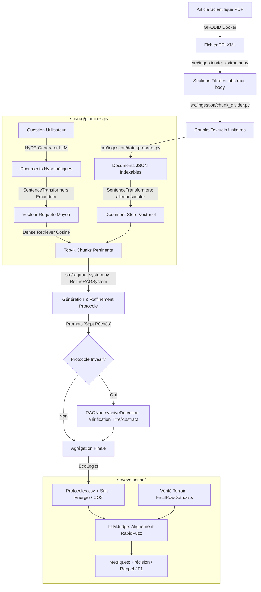

# Architecture du Système StageL3-RAG

Ce document présente l'architecture logicielle et scientifique du système RAG d'évaluation d'échantillonnage non-invasif d'ADN animal.

---

## 1. Flux de Données Global

---

## 2. Décomposition Modulaire

### Module d'Ingestion (`src/ingestion/`)
- `tei_extractor.py` : Parse la structure hiérarchique TEI XML de GROBID, extrait les métadonnées de publication (titre, date, auteurs, pays) et segmente le texte en excluant les sections non pertinentes selon le mode (standard ou invasive_detection).
- `chunk_divider.py` : Segmente les flux concaténés en fichiers unitaires par article.
- `data_preparer.py` : Produit les dictionnaires JSON structurés prêts à alimenter le Document Store Haystack.
- `excel_exporter.py` : Formate les résumés et métadonnées en classeurs Excel.

### Module RAG (`src/rag/`)
- `mainRag.py` : Point d'entrée en ligne de commande avec traitement parallèle (`ProcessPoolExecutor`) par lot de documents.
- `rag_system.py` : Moteurs d'indexation, de recherche et de raffinement itératif (`RefineRAGSystem`) avec détection d'ambiguïté auteur vs réalité (`RAGNonInvasiveDetection`).
- `pipelines.py` : Orchestration des composants Haystack 2.x (Embedder, Generator, Retriever).
- `components.py` : Composants sur mesure dont `HypotheticalDocumentEmbedder`.
- `prompts.py` : Formulations rigoureuses intégrant la définition canonique de Taberlet (1999) et les 7 biais systématiques ("Sept Péchés").
- `UniversityLLMAdapter.py` : Adaptateur HTTP universel (Ollama en local ou API distante) avec instrument de mesure écologique EcoLogits.

### Module d'Évaluation (`src/evaluation/`)
- `judge.py` : Classe unifiée `LLMJudge` implémentant le protocole LLM-as-a-Judge avec appariement lexical rapide (`rapidfuzz`).
- `metrics.py` : Calcul rigoureux des indicateurs de performance (TP, FN, Précision, Rappel, F1-score) aux échelles article et protocole.
